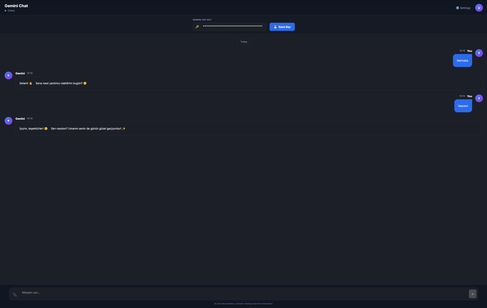

# ChatWithLLM

Modern ve şık bir Gemini AI sohbet uygulaması. Avalonia UI framework'ü ile C# dilinde geliştirilmiştir.


## ✨ Özellikler

- 🎨 **Modern Dark UI** - Şık ve göz yormayan koyu tema
- 🤖 **Gemini 2.0 Flash** - Google'ın en güncel AI modeli
- 💬 **Context Retention** - Önceki mesajları hatırlar, tutarlı sohbet
- 📝 **Markdown Desteği** - Kalın, italik, kod blokları, listeler
- ⌨️ **Typewriter Animasyonu** - Cevaplar harf harf yazılır
- 📎 **Dosya Yükleme** - Metin dosyalarını AI'a gönder
- ⚙️ **Ayarlanabilir Parametreler** - Temperature, max token
- 💾 **Oturum Kaydetme** - Sohbet geçmişi otomatik kaydedilir

## 📸 Ekran Görüntüsü



## 🚀 Kurulum

### Gereksinimler

- [.NET 8.0 SDK](https://dotnet.microsoft.com/download/dotnet/8.0)
- [Gemini API Key](https://aistudio.google.com/app/apikey)

### Çalıştırma

```bash
# Repoyu klonla
git clone https://github.com/berkay123001/ChatWithLLM_OKUL.git
cd ChatWithLLM_OKUL

# Projeyi çalıştır
cd ChatWithLLM
dotnet run
```

### API Key Ayarlama

Uygulamayı çalıştırdıktan sonra:
1. Üst bardaki "GEMINI API KEY" alanına API key'inizi yapıştırın
2. "Save Key" butonuna tıklayın

Veya ortam değişkeni olarak:
```bash
export GEMINI_API_KEY="your-api-key-here"
```

## 🛠️ Teknolojiler

| Teknoloji | Kullanım |
|-----------|----------|
| [Avalonia UI](https://avaloniaui.net/) | Cross-platform UI framework |
| [CommunityToolkit.Mvvm](https://github.com/CommunityToolkit/dotnet) | MVVM pattern |
| [Markdown.Avalonia](https://github.com/whistyun/Markdown.Avalonia) | Markdown rendering |
| [Gemini API](https://ai.google.dev/) | AI model |

## 📁 Proje Yapısı

```
ChatWithLLM/
├── Models/
│   └── ChatMessage.cs          # Mesaj modeli
├── Services/
│   ├── GeminiClient.cs         # Gemini API istemcisi
│   ├── ChatSessionStore.cs     # Sohbet geçmişi kayıt
│   └── AppSettingsStore.cs     # Uygulama ayarları
├── ViewModels/
│   ├── MainWindowViewModel.cs  # Ana pencere logic
│   └── ChatMessageItem.cs      # Mesaj görünüm modeli
├── Views/
│   └── MainWindow.axaml        # Ana pencere UI
└── App.axaml                   # Uygulama ve tema
```

## ⚙️ Ayarlar

Settings panelinden ayarlayabilirsiniz:

- **Model**: gemini-2.0-flash
- **Temperature (Yaratıcılık)**: 0.0 - 2.0 arası
  - 0.0 = Tutarlı, öngörülebilir
  - 1.0 = Dengeli
  - 2.0 = Yaratıcı, çeşitli
- **Max Output Tokens**: 256 - 8192 arası

## 📎 Dosya Yükleme

Desteklenen dosya türleri:
- Metin: `.txt`, `.md`, `.log`
- Kod: `.cs`, `.py`, `.js`, `.ts`, `.html`, `.css`
- Veri: `.json`, `.xml`, `.csv`

## 🤝 Katkıda Bulunma

1. Fork edin
2. Feature branch oluşturun (`git checkout -b feature/amazing-feature`)
3. Commit edin (`git commit -m 'Add amazing feature'`)
4. Push edin (`git push origin feature/amazing-feature`)
5. Pull Request açın

## 📄 Lisans

Bu proje MIT lisansı altında lisanslanmıştır.

## 👤 Geliştirici

**Berkay**

- GitHub: [@berkay123001](https://github.com/berkay123001)

---

⭐ Bu projeyi beğendiyseniz yıldız vermeyi unutmayın!
